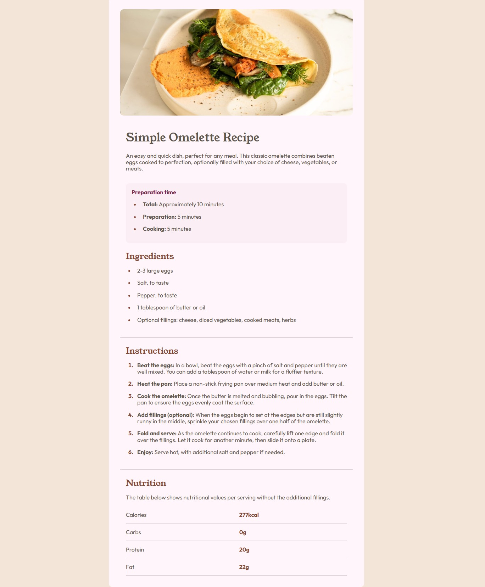

# Frontend Mentor - Recipe page solution

This is a solution to the [Recipe page challenge on Frontend Mentor](https://www.frontendmentor.io/challenges/recipe-page-KiTsR8QQKm). Frontend Mentor challenges help you improve your coding skills by building realistic projects.

## Table of contents

- [Overview](#overview)
- [Screenshot](#screenshot)
- [Links](#links)
- [My process](#my-process)
- [Built with](#built-with)
- [What I learned](#what-i-learned)
- [Continued development](#continued-development)
- [Useful resources](#useful-resources)
- [AI Collaboration](#ai-collaboration)
- [Author](#author)

## Overview

This is my solution to the [Recipe page challenge on Frontend Mentor](https://www.frontendmentor.io/challenges/recipe-page-KiTsR8QQKm).

### Screenshot

### Links

- Solution URL: [https://github.com/BitByBitExplorer/RecipePage_FrontendMentor]
- Live Site URL: [https://bitbybitexplorer.github.io/RecipePage_FrontendMentor/]

## My process

As I'm still new to HTML/CSS, I always start with what I already know (to test my knowledge). I write as much of the HTML as I can. Then customize all I have in CSS. Once I'm finished with that - and the layout starts taking shape - I focus more on the big picture and fine-tuning the details in my HTML and CSS - what I might have forgotten, layout that is not yet as it should be, etc., to come as close to the intended design as possible. Also in this second phase I start using helpful tools and consult with AI to help me see, what I might have missed or how I can improve my code.

### Built with

- Semantic HTML5 markup
- CSS custom properties
- Flexbox
- Mobile-first workflow
- Normalize.css

### What I learned

As a beginner in HTML & CSS I learned a couple of things in this project. But I am also proud, because I solved this challenge almost without having to look up the used concepts or using AI, despite implementing a couple of things I have learned in theory, but didn't use so far on a project. For example I used the "mobile-first-method", created a @media-query, lists, a variable and an accessible table. In the end though, because I wanted to improve my code, I used AI to check it and give me some useful tips on what I can do even better.

### Continued development

I still have a long way to go, despite making progress every day.

### Useful resources

If I'm stuck on something and need to check out the theory on a concept I use usually [w3schools](https://www.w3schools.com)

### AI Collaboration

I use Google Gemini in a mentor capacity. I set it up not to give me any finished code, but to rather give me answers/questions that guide me into the right direction if I ask it a question - so I have to find the solution myself.

## Author

- Website - [BitByBitExplorer](https://https://github.com/BitByBitExplorer)
- Frontend Mentor - [@BitByBitExplorer](https://wwwnfrontendmentor.io/profile/BitByBitExplorer)
